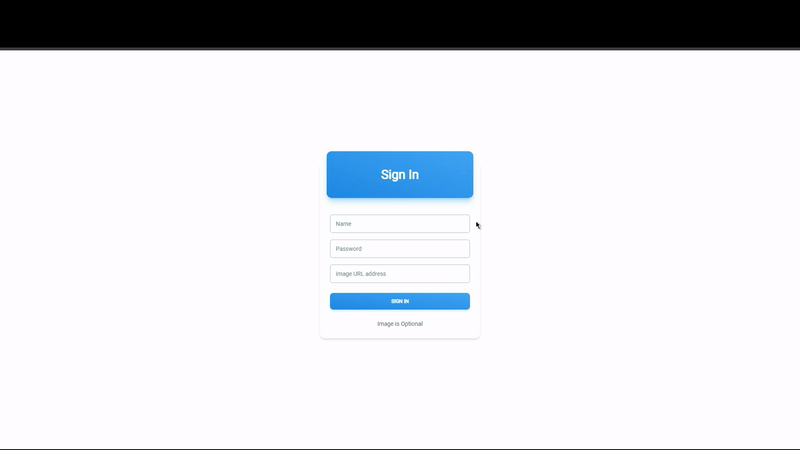

# Udemig E-commerce Project With Redux-Toolkit

This project was created by Yasin Özboğa.
This project was created with React.js, JavaScript, Tailwind and Redux-Toolkit techonogies.
Redux-Toolkit was used for state management and Tailwind was used for style management.
The products were designed in card form for increase experience of the users.
The multi-page was designed for strolling the users comfortably on the e-commerce website.

## Used Libraries

```
react-router-dom react-icons react-redux @reduxjs/toolkit tailwind
```

## Features

- **Fully Responsive**
- **Available Navbar**
- **Add product to shopping bag**
- **Delete product from shopping bag**

# Start the project

- `npm run dev`

## Preview


